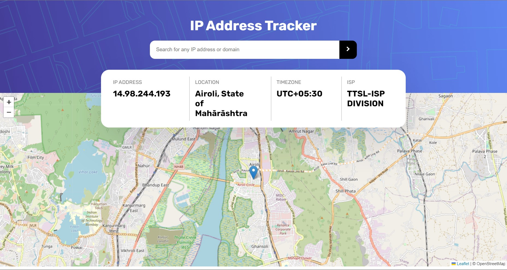

# IP ADDRESS TRACKER

### Overview
This app displays information about an IP Address, like the location time zone and the ISP. It also locates the the IP location on a map. By default the app shows information about the current IP Address of the client.

### Technologies Used

* HTML
* CSS
* JAVASCRIPT

### API used
* Leaflet 
* IPify JS

> The design and concept of this App is inspired from a challenge on [Frontend Mentor](https://www.frontendmentor.io/)